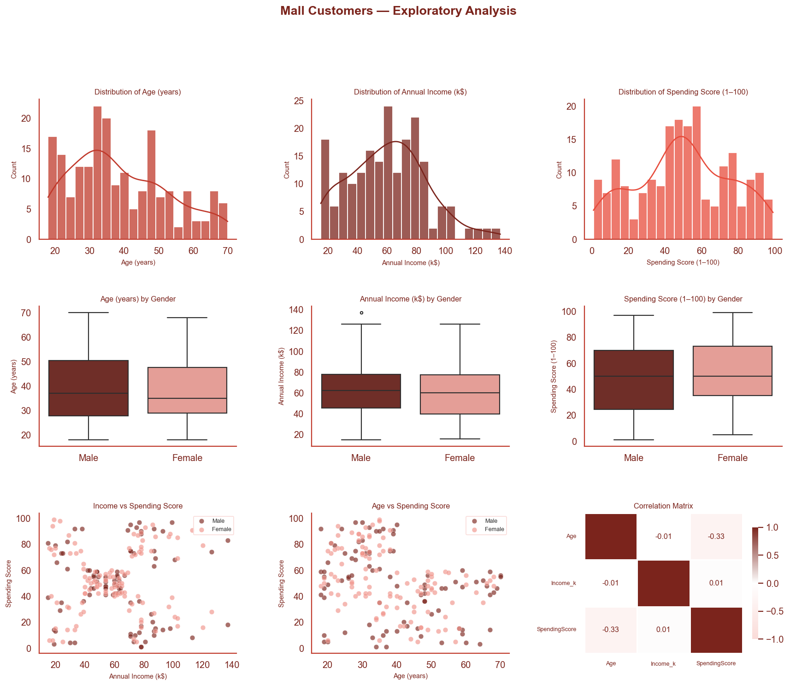
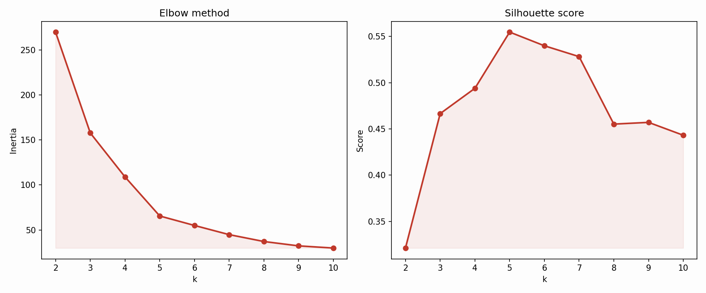
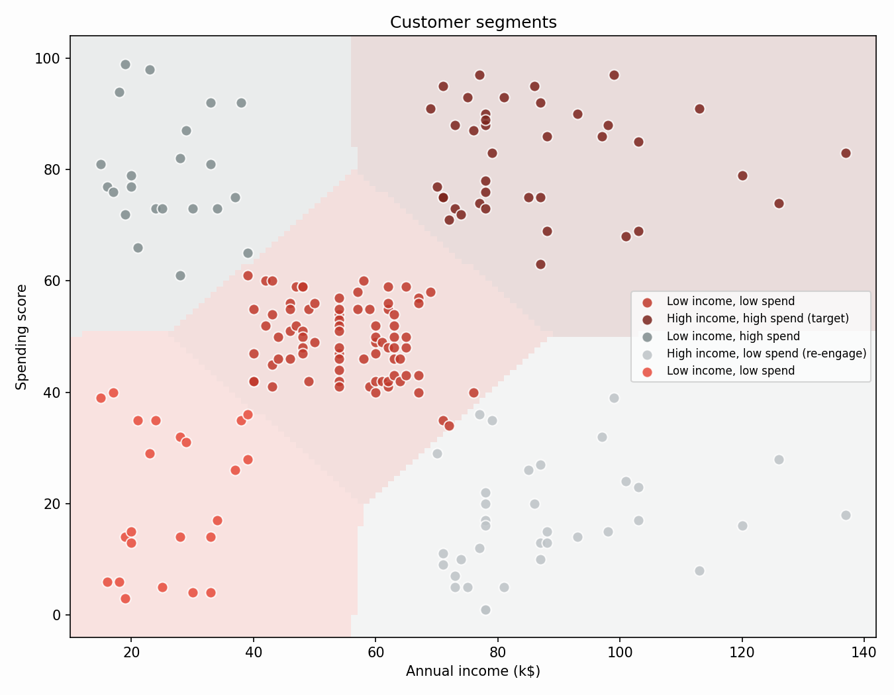
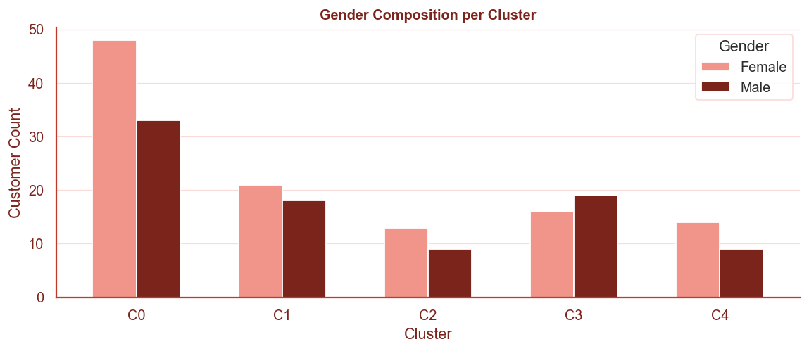
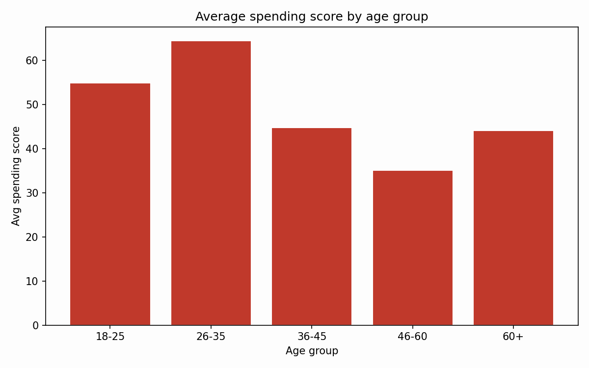

# Mall Customer Segmentation Analysis

## Project Overview

A Python-based customer segmentation analysis on mall customer data, using k-means clustering on income and spending score to split customers into distinct groups and guide where marketing and retention effort should go.

The analysis covers data quality checks, exploratory analysis, cluster selection, k-means clustering with descriptive cluster labels, and a gender/age breakdown of the resulting segments. Implemented in mall_analysis.py, with mall_analysis.ipynb kept as a matching notebook version.

---

## Business Problem

Mall management currently has no structured view of how customers differ from one another, only a single combined customer base. Without knowing which customers spend the most relative to their income, and which don't, marketing spend and loyalty efforts risk being aimed at the wrong groups or spread too thinly across all of them equally.

This project investigates whether distinguishable customer segments exist within the mall's customer base, and what each one implies for how marketing and retention effort should be prioritized.

---

## Business Questions

* What natural customer segments exist based on annual income and spending score?
* How many segments best represent the customer base without over-complicating the picture?
* Which segments represent the most valuable customers, and which are underperforming relative to their income?
* Does gender or age relate to how customers fall into these segments?

---

## Dataset

**Source:** Mall_Customers.csv, a sample mall customer dataset.

The analysis works from a single flat customer-level table rather than a relational model, since there is only one entity (the customer) involved.

* **Coverage:** 200 customers, a single snapshot rather than a time series
* **Fields:** CustomerID, Gender, Age, Annual Income (k$), Spending Score (1-100)
* **Data Model:** One flat table, no joins required

---

## Tools Used

* Python
* pandas
* scikit-learn (KMeans, StandardScaler, silhouette_score)
* matplotlib

---

## Key Metrics

* Annual Income
* Spending Score
* Age
* Cluster size (share of customers per segment)
* Silhouette score (used to sanity-check the chosen number of clusters)

---

## Key Findings

* Age, income, and spending score are each spread fairly broadly across the customer base, rather than concentrated around one typical value.

* The elbow method and silhouette score both support k = 5 as a reasonable number of clusters, balancing simplicity against how separated the groups are.

* Clustering on income and spending score produces five segments: a high-income, high-spending group ("target"), a high-income, low-spending group ("re-engage"), a low-income, high-spending group, a low-income, low-spending group, and a middle-income, average-spending group that sits near the centre of the other four.

* The gender mix looks broadly similar across most segments, without one gender clearly dominating any single income/spending group.

* Average spending score varies by age band (18-25, 26-35, 36-45, 46-60, 60+), with younger bands generally averaging higher spending scores than older ones.

---

## Business Recommendations

1. Prioritize the high-income, high-spending ("target") segment for loyalty programs and premium offers, since they are the most valuable customers already engaging at a high level.

2. Re-engage the high-income, low-spending group with targeted promotions or research into why they aren't converting, since they have spending capacity that isn't being captured.

3. Use the middle-income, average-spending segment as a baseline when judging whether a campaign is shifting behavior elsewhere, since it's the closest thing to a "typical" customer in this dataset.

4. Investigate younger age bands further if they show higher spending momentum, since they may be worth investing in earlier for long-term loyalty.

---

## Visual Preview

### Exploratory Analysis

### Choosing k

### Cluster Segments

### Gender by Cluster

### Spending by Age Group

---

## Technical Highlights

* Built helper plotting functions (scatter_by_gender, line_with_fill) instead of repeating matplotlib boilerplate for every chart.
* Used the elbow method and silhouette score together, rather than picking k from a single heuristic.
* Standardized features (StandardScaler) before clustering so income and spending score are weighted fairly.
* Labeled clusters by comparing each cluster's average income/spending to the dataset median, with a grand-centroid check so the middle cluster doesn't collide with the four quadrant labels.
* Added decision-boundary shading to the cluster plot so the region each cluster occupies is visible, not just the raw points.
* Kept mall_analysis.py and mall_analysis.ipynb in sync, so either can be used to reproduce the same charts in viz/.

---

## Project Files

* mall_analysis.py – main analysis script.
* mall_analysis.ipynb – notebook version, mirrors the script.
* Mall_Customers.csv – source dataset.
* viz/ – generated charts referenced above.
